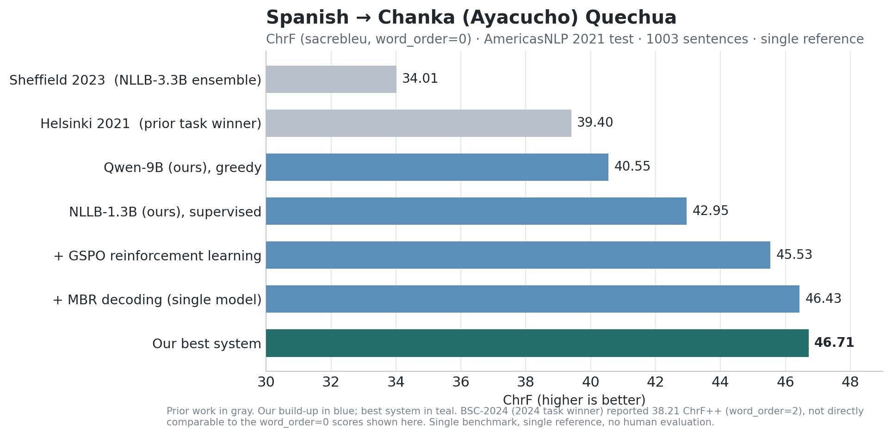
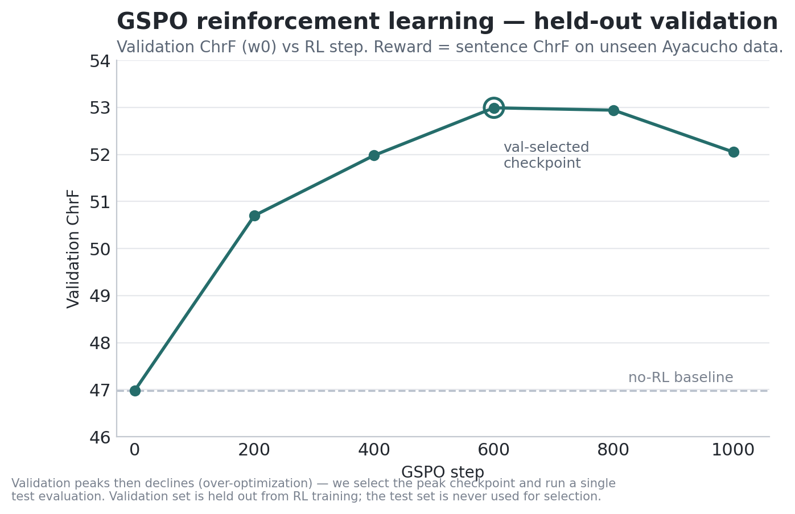
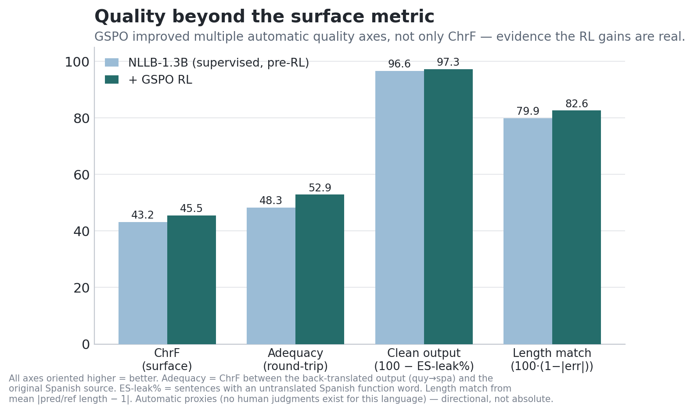
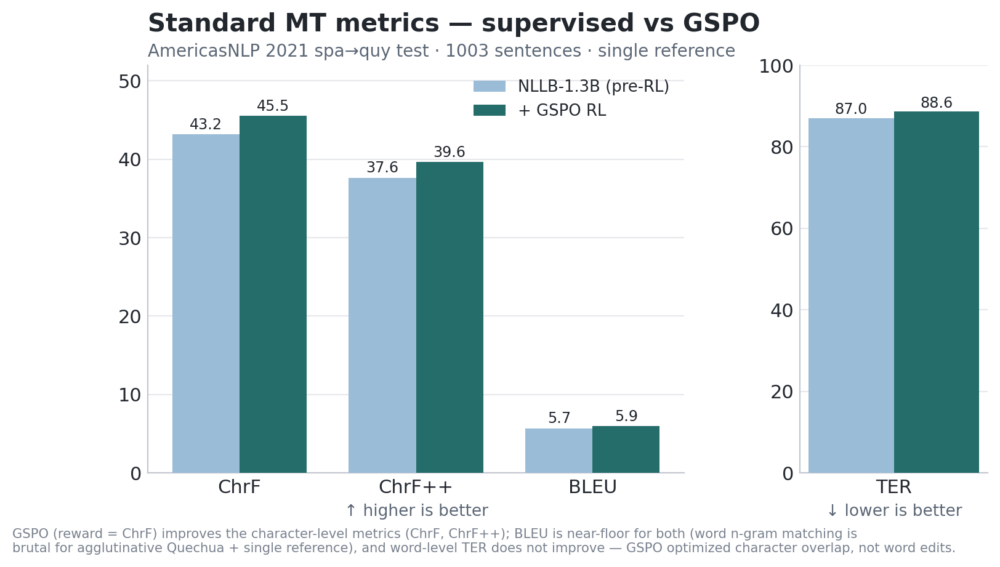

---
language:
- quy
- es
tags:
- translation
- machine-translation
- quechua
- chanka
- ayacucho-quechua
- low-resource
- reinforcement-learning
- gspo
- lora
- peft
- nllb
license: cc-by-nc-4.0
pipeline_tag: translation
base_model: facebook/nllb-200-1.3B
library_name: peft
---

# rosettia-quy — Spanish → Chanka/Ayacucho Quechua (GSPO-NLLB)

A **LoRA adapter** for `facebook/nllb-200-1.3B` for **Spanish → Chanka / Ayacucho
Quechua** (`quy_Latn`), trained with **GSPO reinforcement learning** (Group Sequence
Policy Optimization) on top of a synthetic-augmented supervised model.

To our knowledge this is the **first application of GSPO to an encoder–decoder NMT
model**. It is the strongest result we are aware of on the AmericasNLP 2021 spa→quy
benchmark — but please read the **Limitations** section: this is a research-grade
system, evaluated on a single benchmark with single-reference ChrF and **no
native-speaker evaluation**.



## Results — AmericasNLP 2021 spa→quy test

ChrF (`sacrebleu`, `word_order=0`), 1003 sentences, single reference. The test set was
**never** used for training, tuning, or checkpoint selection.

| System | ChrF (w0) |
|---|---:|
| Sheffield 2023 (NLLB-3.3B, 3-model ensemble) | 34.01 |
| Helsinki 2021 (prior task winner) | 39.40 |
| Qwen-9B (ours), greedy | 40.55 |
| NLLB-1.3B (ours), supervised + synthetic | 42.95 |
| Qwen-9B ⊕ NLLB-1.3B ensemble (ours) | 45.01 |
| **+ GSPO RL**, single model, beam5 | 45.53 |
| **+ MBR decoding**, single model | 46.43 |
| **GSPO multi-checkpoint MBR ensemble (best)** | **46.71** |

GSPO adds **+2.6 ChrF** over the supervised model, and the best single **1.3B** model
(46.43) matches our previous, much larger **9B + 1.3B** ensemble — a simpler, smaller
system at equal quality.

> **A note on comparability.** Many shared-task papers report **ChrF++** (`word_order=2`),
> which typically reads ~2–3 points higher than the `word_order=0` ChrF used here (e.g.
> BSC-2024, the 2024 task winner, reported 38.21 ChrF++). Cross-metric comparisons should
> be made with care; all of our numbers above are `word_order=0`.

## How GSPO helped



Reward = sentence-ChrF against **held-out, unseen** Ayacucho references (deduplicated
against the model's exact training corpus). Validation ChrF climbs, peaks, then declines
(over-optimization); we **select the peak checkpoint on validation** and run a **single**
test evaluation. The test set is never used for selection.

## Quality beyond the surface metric

ChrF is a single-reference surface metric and saturates. To check the RL gains are *real*
quality (not metric-gaming), we score several automatic, speaker-free axes:



| Axis | NLLB-1.3B (pre-RL) | + GSPO | direction |
|---|---:|---:|---|
| ChrF (w0) | 43.17 | 45.53 | higher better |
| Adequacy (round-trip quy→spa vs source) | 48.28 | 52.86 | higher better |
| Spanish-leakage (% sentences) | 3.39 | 2.69 | lower better |
| Length miscalibration (mean \|len ratio−1\|) | 0.201 | 0.175 | lower better |

**GSPO improved adequacy (+4.6) by more than it improved ChrF (+2.4)**, and reduced
leakage and length error — i.e. the gains are multi-axis quality, not surface gaming.
(These are automatic proxies; no human judgments exist for this language pair.)

## Standard MT metrics (supervised vs GSPO)



| Metric | NLLB-1.3B (pre-RL) | + GSPO | direction |
|---|---:|---:|---|
| ChrF (w0) | 43.17 | **45.53** | higher better |
| ChrF++ (w2) | 37.63 | **39.64** | higher better |
| BLEU | 5.65 | **5.94** | higher better |
| TER | 87.02 | 88.62 | lower better |

We report all four for transparency. GSPO (reward = ChrF) improves the **character-level**
metrics (ChrF, ChrF++) and BLEU marginally, but **word-level TER does not improve** — the
RL optimized character overlap, not word edits. BLEU is near-floor for both systems: word
n-gram matching is unreliable for an agglutinative language under a single reference, which
is exactly why we treat **ChrF as the primary metric** here.

## Training

- **Base / SFT:** NLLB-200-1.3B → LoRA (BSC-2024 recipe, r256/α512) → + ~198k synthetic
  forward-translated pairs → supervised model (42.95).
- **RL:** GSPO — sequence-level (length-normalized) importance ratio + group-relative
  advantage + KL-to-frozen-reference. Reward = sentence-ChrF vs unseen Ayacucho refs.
  Group size 16. Rollouts via an in-process vLLM engine (we implemented NLLB/M2M-100
  support for vLLM) with per-step weight sync.
- **Data hygiene:** RL data deduplicated against the model's exact training corpus **and**
  the test set; dialect-filtered to Ayacucho/Chanka; separate validation split for
  checkpoint selection; one final test evaluation.

## Usage

```python
import torch
from transformers import AutoTokenizer, AutoModelForSeq2SeqLM
from peft import PeftModel

tok = AutoTokenizer.from_pretrained("facebook/nllb-200-1.3B", src_lang="spa_Latn", tgt_lang="quy_Latn")
m = AutoModelForSeq2SeqLM.from_pretrained("facebook/nllb-200-1.3B", torch_dtype=torch.bfloat16)
m = PeftModel.from_pretrained(m, "Thermostatic/rosettia-quy-gspo-nllb13b-lora").cuda().eval()
bos = tok.convert_tokens_to_ids("quy_Latn")
enc = tok("No sé por qué sucedió eso.", return_tensors="pt").to("cuda")
out = m.generate(**enc, forced_bos_token_id=bos, num_beams=5, max_new_tokens=128)
print(tok.batch_decode(out, skip_special_tokens=True)[0])  # -> Manam yachanichu imarayku chay pasarqa.
```

The root adapter is the validation-selected single model (standalone 45.53 / self-MBR
46.43). For the best result (46.71), sample candidates from this adapter **and** the
`checkpoint-800/` adapter, deduplicate, and pick the ChrF-MBR consensus. Apostrophe
suppression at decode is a small free gain (Ayacucho quy has no glottalization).

## Limitations & intended use

- **Research-grade**, validated on a **single benchmark** with **single-reference ChrF**.
  ChrF ~46 means roughly half the character n-grams match one reference — useful as a
  draft, **not** production quality. Review with speakers before consequential use.
- **No native-speaker / multi-reference evaluation** was performed (no Chanka experts were
  available); all "quality" axes here are automatic proxies.
- Known residual issues: numbers are often kept as digits rather than spelled out in
  Quechua; occasional Spanish loanword spelling; rare repetition (mitigated with
  `no_repeat_ngram_size=3` at decode).
- Dialect: **Ayacucho/Chanka** (`quy`). Not validated for Cuzco (`quz`) or Central varieties.
- License `cc-by-nc-4.0`; non-commercial, consistent with the underlying data sources.

## Links & resources

- **Code & methodology:** https://github.com/Sekinal/rosettia-chanka
- **Merged (standalone) model**, no PEFT needed: https://huggingface.co/Thermostatic/rosettia-quy-gspo-nllb13b-merged
- **NLLB / M2M-100 support for vLLM** (our fork — used for fast GSPO rollouts; NLLB was unsupported upstream): https://github.com/Sekinal/vllm/tree/add-nllb-m2m100-support
- **Data:** https://huggingface.co/datasets/Thermostatic/rosettia-chanka-data
- **Qwen-9B sibling model** (the other ensemble member): https://huggingface.co/Thermostatic/rosettia-quy-v30b-9b-merged
- **Base model:** https://huggingface.co/facebook/nllb-200-1.3B
- **GSPO:** Zheng et al. 2025, *Group Sequence Policy Optimization* (arXiv:2507.18071)
